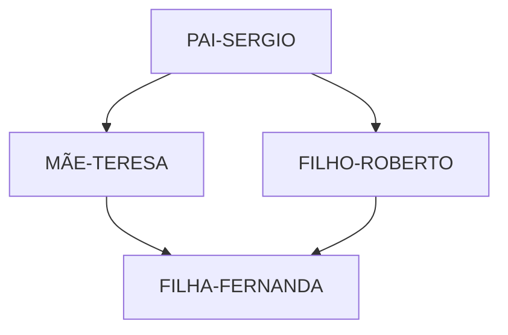
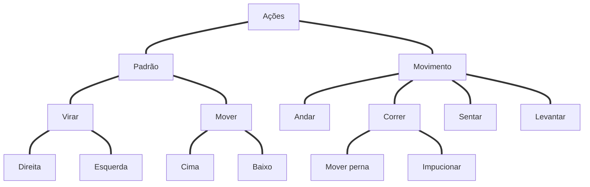
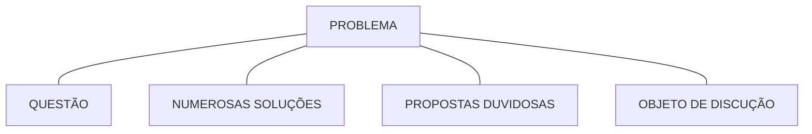
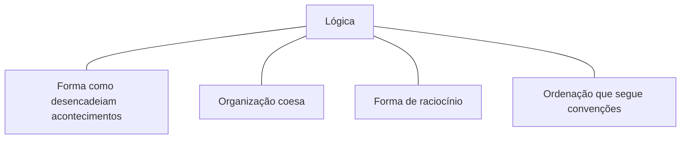
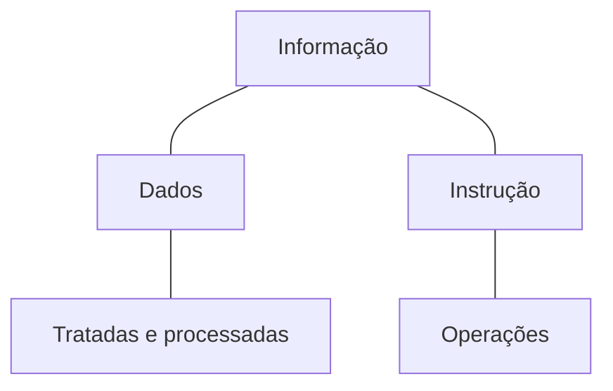

## Introdução à Programação e Pensamento Computacional

##### Pensamento contutacional
- [X] Apresentação
- [X] Introdução
- [X] Habilidade complementares
- [X] Pilares: Decomposição
- [X] Pilares: Padrões
- [X] Pilares: Abstração
- [X] Pilares: Algoritmos
- [X] Estudo de caso conceitual: perdido
- [X] Estudo de caso aplicado: Soma de um intervalo
- [X] Estudo de caso aplicado: Adivinhe um número

##### Introdução à lógica de progrmação
- [X] O que é lógica?
- [X] Técnicas de lógica de programação

#### Fundamentos de algoritimos
- [X] Tipologia e variáveis
- [ ] Instruções primitivas
- [ ] Estruturas condicionais e operadores
- [ ] Estruturas de repetição
- [ ] Vetores e matrizes
- [ ] O que são funções?
- [ ] Instruções de entrada/saída

#### Linguagens de programação
- [ ] Introdução à linguagens de programação
- [ ] Como um computador entende o programa?
- [ ] Características de um programa
- [ ] Análises de código
- [ ] Paradigmas de programação

#### Primeiro contato com progrmação
- [ ] Algoritmos em portugol
- [ ] Considerações finais
- [ ] Materiais de apoio
- [ ] Certifique seu conhecimento


### Apresentação
  - Juliana Mascarenhas
    - Tech Education Specialist / Sócia (Content Creator) @SimplificandoRedes
    - Me Modelagem Computacional / Cientista de dados
    - @in/juliana-mascarenhas-ds/

    - Tech Education Specialist
    - Sócia no @SimplificandoRedes
    - https://github.com/julianazanelatto
    - Cientista de dados
    - Desenvolvedora Java/Python
    - Me Modelagem Computacional - LNCC


### Objetivo Geral
Você será capaz de entender o que significa pensar computacionalmente.
Pensamento aplicável à qualquer área do conhecimento.

Dessa forma, será capaz de resolver qualquer problema de uma maneria mais objetiva e eficiente.

### Percurso
  - Aula 1 Pensamento Computacional
  - Aula 2 Introdução à lógica da programação
  - Aula 3 Fundamentos de Algoritmos
  - Aula 4 Linguagens de programação
  - Aula 5 Primeiro contato com a programação


## Aula 1: Pensamento Computacional
 //Primeiros passos para começar a programar
 
###Objetivo Geral
Apresentar os conceitos que caracterizam o pensamento com putacional, permitindo que o Dev entenda o que significa pensar computacionalmente.

### Percurso
 - Etapa 1 Introdução ao pensamento computacional
 - Etapa 2 Habilidade complementares
 - Etapa 3 Pilares: Decomposição
 - Etapa 4 Pilares: Padrões
 - Etapa 5 Pilares: Abstração
 - Etapa 6 Pilares: Algoritmos
 - Etapa 7 Estudo de caso conceitual: perdido
 - Etapa 8 Estudo de caso aplicado: Soma de um intervalo
 - Etapa 9 Estudo de caso aplicado: Adivinhe um número

## Etapa 1 Introdução ao pensamento computacional
// Primeiros passos para programar/Pensamento Computacional

#### Overview
Pensamento computacional?

Processo de pensamento envolvido na expressão de soluções em passos computacionais ou algoritmos que podem ser implementados no computador.

(Aho, 2011; Lee, 2016)


> Habilidade generalista
  - Sistemático e eficiente
    - Formulação e resolução de problemas

  - Sejam capazes de resolver
    - Humanos & máquinas

  - Baseado em 4 pilares - Dividir um problema complexo em subproblemas
    - Decomposição
    - Reconhecimento de padrões
    - Abstração
    - Design de algoritmos

 - 1 Dividir um problema complexo em subproblemas
 - 2 Identificar padrões ou tendências
    - Similaridades e diferenças entre os problemas - Padrão comportamental
 - 3 Extrapolar o conceito do problema para um forma generalista   
 > POO
 > - Classes
 > - Métodos
 > - Heranças
 > - Poliformismo

- 4 Automatizar Definir passo a passo a solução do problema.


### Overview
Processo Contínuo
• Definir uma solução
• Testar a solução
• Aperfeiçoamento da solução encontrada

.


.


.


.


### Exemplos
###### Química
- Aperfeiçoamento de reações químicas pela utilização de algoritmos, através da identificação de quimícos 
###### Engenharia
- Simulações de aeronavas executadas via software em detrimento do tunel de vento
###### Biologia
- Modelagem e mapeamento do genoma humano
###### Computação
- Simulação de problemas de alta ordem em supercomputadores


### Competências
 - Pensamento sistemático
 - Colaboração dentro da equipe
 - Criatividade e design
 - Facilitador


## Etapa 2 Habilidades complementares
// Primeiros passos para começar a programar/Pensamento Computacional

### Habilidades
 - Raciocínio Lógico
 - Aperfeiçoamento
  
**Raciocínio lógico** é uma forma de pensamento estruturado, ou raciocínio, que permite encontrar a conclusão ou determinar a resolução de um problema.

- Classificação
  - Indução - Ciências experimental
  - Dedução - Ciências exatas
  - Abdução - Processo investigativo e Diagnostico

Indução(Fenômeno observado) -> Leis e Teorias -> Dedução(Previsões e explicações) -> Abdução (Apartir de uma conclusão se tem uma Premissa)

> Ex.: A grama está molhada, logo deve ter chovido.

 .


> Um pai, mãe e seu casal de filhos estão sentados em uma mesa. Os homens se chamam Roberto e Sérgio, as mulheres Teresa e Fernanda. Sabe-se que o pai está à frente de Fernanda e o filho e esquerda; e que a mãe está do lado direito de Sérgio.



Melhoramento = Ato de aperfeiçoar = Aprimoramento = Refinamento

```
A partir de uma solução, determinar pontos de melhora e refinamento
```

#### Ato de aperfeiçoar
  - Melhor uso de recursos
    - Encontrar solução eficiente 
    - Otimizar processos

  - Melhorar códigos e algoritmos
    - Simplificar linhas de códigos
    - Funções bem definidas


### Etapa 3 Pilares: Decomposição
// Primeiros passos para começar a programar/ Pensamento Computacional/


#### Objetivo Geral
É preciso coompreender como executar cada etapa de um pensamento computacional.

Dessa forma, as aulas subsequêntes são dedicadas à compreensão individual de cada pilar desse processo de pensamento.

```
"If you can't solve a problem,
then there is an easier
problem that you can solve: find it"

*George Polya – professor e matemático*
```

Primeiro passo da resolução de problemas dentro do conceitode pensamento computacional 

"Dado um problema complexo, devemos quebra-lo em problemas menores. Portanto, problemas mais fáceis e gerenciáveis."

### Estratégia
#### Análise
Processo de quebrar e determinar partes menores e gerenciáveis
  - Estudar, explorar 
  - "realizar exame detalhado" 
  - Decompor em elementos constituíntes

#### Síntese
Combinar os elementos e recompondo o problema original
 - Processo de reconstrução
 - Fundir os elementos de maneira coerente
 - Consiste em reunir elementos distintos em um único elemento

#### Ordem de execução de tarefas menores
  - Sequêncial
  - Paralelo

### Sequêncial
Ordem de execução de tarefas menores
  - Dependência entre tarefas.
  - Executadas em "fila"

### Paralelo
Ordem de excução de tarefas menores. Tarefas podem ser execultadas concomitantemente
 - + Eficiência
 - - Tempo

- Variáveis
- Pequenos Problemas
- Segmentação

 - Não basta aplicar
 - Desenvolver a decomposição "By yourself"

> Maneiras distintas de decompor o mesmo problema.

### Como decompor?
Identificar ou coletar dados => Agregar os dados => Funcionalidade => Decomposição

##Exemplos

**Exemolo do cotidiano: cozinhar**
  - Identificar os ingredientes
  - Determinar as etapas (sequêncial ou paralelo)
  - Executar cada etapa
  - Agregar os ingredientes para finalizar (Recompor com coerência)

**Exemplo do cotidiano: funcionamento de uma bike**
Funcionamento do sistema
 - Identificar os componentes
 - Papel de cada componente
 - Interdependência das peças

**Exemplo: criar um app** - Desenvolvimento mais eficiênte
Definição de componentes e etapas
  - Finalidade
  - Interface
  - Funcinalidades
  - Pré-requisitos
 
 **Exemplo: Artigo** - Sequencial ou paralelo em ordem ou não
Definição de componentes e etapas
  - O que será abordado?
  - Estrutura
  - Conteúdo de cada tópico
  - Textos de conexão
 
 **Exemplo: movimentos de um avatar**
 



## Etapa 4 Pilares: Padrões
// Primeiros passos para começar a programar/ Pensamento Computacional/

**Reconhecimento de Padrões**
  - Modelo base
  - Estrutura invariante
  - Repetição

Similaridades e diferença


**Ex: fotos de redes sociais**
Compressão -> Salvar no servidor de dados

Processos utilizados por plataformas diferentes

**Ex: Compressão de dados**
Compressão por reconhecimento de padrões


Seres vivos x padrões
EX.: Determinar padrões de Frutas e Doces
  - Frutas: Natural, etc
  - Doces: Fabricado, etc

**Por que determinar padrões?**

Generelizar, com objetivo de obter resolução para problemas diferentes

 - Classes
 - Categorias

> Tipo de media,Dependem do domínio

**Como o ser humano reconhece padrões?**
  - Grau de similaridade
  - Grupos conhecidos x objeto desconhecido


**Como o computador reconhece padrões?**
  - Comparação

    => Representação de atributos
    => Aprendizado – conceito associado ao objeto
    => Armazenar dados
    => Regras de decisão

-----------------------
Em resumo ...
  - Abordagem
    - Extração de características
    - Classificação de dados
    
  - DIFERENTES
    - Métodos
    - Aplicação 

----------------------  

### Aplicações
  - Classificação de dados
  - Reconhecimento de imagem
  - Reconhecimento de fala
  - Análise de cenas
  - Classificação de documentos

> Onde se aplicam:**Machine Learning**, **Redes Neurais**, **Inteligência Artificial**, **Ciência de dados**.


## Etapa 6 Pilares: Algortimos
// Primeiros passos para começar a programar/ Pensamento Computacional/

  - Energia
  - Trabalhador
  - Eficiência
  - Rapidez

Precisa de instruções detalhadas  
Não opera sozinho

#### Processamento de dados
Programas - O computador recebe,  manipula e armazena dados. O programa são as instruções.

Processo de resolução de problemas "step by setp" utilizando instruções

Instruções
  - O que presisa ser feito
  - Qual a ordem de execução

> As instruções devem ser entendidas pelo humano e maquina.

#### Desenvolvimento do Programa
  Análise   
    - Estudo e definição dos dados de entrada e saída(Instruções detalhadas)  
    
  Algoritmo   
    - Descreve o problema por meio de ferramentas narrativas, fluxograma, ou pseudocódigo  
  
  Codificação  
    - O algoritmo é codificado de acordo com a linguagem de programação escolhida  
    
 
>  - Sequência de passos com objetivo definido
>  - Execução de tarefas específicas
>  - Conjunto de operações que resultam em uma sucessão finita de ações  

#### Exemplos do que pode ser feito um algoritimo
  - Preparar uma sanduiche
  - Tocar uma lampada
  - Fazer uma receita de bolo
  - Trajato ao trabalho

Instruções executadas passo a passo para concluir a tarefa


Como construir um algoritmo?
  - Compreenção do problema - Pontos mais importantes
  - Definição dados de entrada - Dados fornecidos e Cenário
  - Definir processamento - Cálculos e Restrições
  - Definir dados de saída - Após processamento
  - Utilizar um método de construção - Construção e refinamento do algoritmo
  - Teste e diagnóstico

#### Construção de algoritmos
- Narrativa - Utilização da linguagem natural Diversas interpretações possíveis - Sem conceitos novos
- Fluxograma - Utilização de símbolos pré-definidos - Conhecimento prévio da estrutura e símbolos - Simples entendimento
- Pseudocódigo - Portugol - Passos a serem seguidos - Regras definidas


Multiplicação de dois números:  
Passo 1 – recebe os valores  
Passo 2 – Multiplica  
Passo 3 – Imprime resultado  

Média de alunos:  
Passo 1 – recebe os valores  
Passo 2 – Calcula a média  
Passo 3 – Imprime resultado  
Passo 4 – Regra de aprovação  
Passo 5 – Imprima o resultado  

## Etapa 7 Estudo de caso conceitual: perdido
// Primeiros passos para começar a programar/ Pensamento Computacional/

##### Perdido
Como resolver o problema utilizando o pensamento computacional?

  - Identificar mecanismos
  - Recursos comuns
  - Detalhes mais importantes

Sobrevivência
  - Água
  - Comida
  - Abrigo

> Decomposição do problema original

.

.

.

.

.

.


#### Determinar instruções passo a passo para cozinhar

So far so good …  
  - Decomposição
  - Reconhecimento de padrões
  - Abstração
Próximo passo ...

.


Mesmo processo para
  - Encontrar água
  - Construir abrigo
  - Máximizar chances de resgate
  - ...

## Etapa 8 Estudo de caso aplicado: soma de um intervalo
// Primeiros passos para começar a programar/ Pensamento Computacional/

### Soma de intervalo
// Solução ineficiente!

Ex: soma de n° entre 1 e 200  
1+2  
1+3  
1+4  
1+5 ...  


// Outra forma de expressar a solução  
Ex: soma de n° entre 1 e 200  
200 + 1  
199 + 2  
198 + 3  
197 + 4 ...  


Ex: soma de n° entre 1 e 200

##### Decomposição
200 + 1  
199 + 2  
198 + 3  
197 + 4 ...  

##### Padrão  
200 + 1 = 201  
199 + 2 = 201  
198 + 3 = 201  
197 + 4 = 201 ...  

Como espressar de forma genetalista?

Ex: soma de n° entre 1 e 200  
200 + 1 = 201  
199 + 2 = 201  
198 + 3 = 201  
197 + 4 = 201  
...  

Valor se repete  
Quantas vezes?  
200/2 = 100  
Resultado  
201 x 100 = 20.100  

Expressar em variáveis  
Ex: soma de n° entre x e y  
[x, y] -> intervalo   => 1 e 200


Ex: soma de n° entre x e y  
[x, y] -> intervalo   -> 1 e 200  

y+x = resultado parcial  
(y-1) + (x+1) = resultado_parcial  
…  

200 + 1 = 201  
199 + 2 = 201  


Expressar em variáveis  
Ex: soma de n° entre x e y  
[x, y] -> intervalo  

y+x = resultado parcial  
(y-1) + (x+1) = resultado_parcial  
…  

y/2 = total  
200/2 = 100  

total x resultado parcial = resultado  
100 x 201 = 20.100  

##### Algoritimo
Passo 1 – Recebe os valores (x e y)   
Passo 2 – Resolva:    
y/2 = total   
Passo 3 – Resolva:    
y+x = resultado_parcial   
Passo 4 – Ache o total    
Final = total x resultado_parcial   
Passo 5 – Imprima o resultado   


## Etapa 9 Estudo de caso aplicado: adivinhe o número
// Primeiros passos para começar a programar/ Pensamento Computacional/

#### Adivinhe o número

Ex: adivinhe o número

O problema consiste em determinar o número escolhido por uma pessoa dentro de um intervalo.

Perguntas com respostas de sim e não.

Possível solução  
Ex: adivinhe o número  
O número é 1?  
O número é 2?  
O número é 3?  
...  


Possível solução  
Ex: adivinhe o número  
O número é 1?  
O número é 2?  
O número é 3?  
...  

 - Ineficiente
 - Desperdício de tempo

Possível solução (Numero de tentativas muito menor)
Ex: adivinhe o número 
P: O número é maior que 50?
R: Não.
P: O número é menor que 20?
R: Sim.
…

até encontrar o número


Ex: Busca binária  
Método de busca  
Mais eficiente que busca por varredura  
3 - 5 - 6 - (9) - 22 - 27 - 45 - 55  
20 - (27) - 45 - 55  
(20)  

Passo 1 – Ordenar o vetor  
Passo 2 – Módulo de L/2  
Passo 3 – Acessar estrutura  
Passo 4 – Comparar valores  
Passo 5 – Repita até encontrar o número  
Passo 6 – Imprima "Busca bem sucedida"  

#### Habilidade
Como aprimorar essa habilidade?

Permitindo que seus alunos expliquem suas decisões e seu  
processo de desenvolvimento ...  
(Brennan & Renesck)  

Para um problema proposto


# Aula 2: Introdução à Lógica de programação
// Primeiros passos para começar a programar

### Objetivo Geral

Esta aula foca em apresentar o conceito de lógica  
aplicada à programação, como um processo de pensamento  
atrelado ao conceito de algoritmos e resolução de  
problemas.  


#### Percurso
Etapa 1 O que é Lógica?  
Etapa 2 Técnicas de lógica da programação  
Etapa 3 Breve história da computação  

#### O que é Lógica?
Primeiros passos para começar a programar

Definição formal  
"Problema é uma questão que foge a uma determinada regra,  
ou melhor é um desvio de percurso, o qual impede de atingir  
um objetivo com eficiencia e eficácia."  




**Definição formal de lógica**  
"Parte da filosofia que trata das formas do pensamento  
em geral (dedução, indução, hipótese, inferência etc.) e  
das operações intelectuais que visam à determinação do  
que é verdadeiro ou não."  




**Lógica**  
"Organização e planejamento das instruções, assertivas em  
um algoritmo, a fim de viabilizar a implantação de  
um programa."  

Percebe que essa  
definição se aplica no  
seu cotidiano?  

**Falta de costume**  
Seres humanos podem prever  
comportamentos, computadores não.  
Instruções detalhadas  

**Por que entender a lógica em programação?**

"Everybody in this country should learn  
how to program a computer because it  
teaches you how to think."  
Steve Jobs 

"Todos neste país deveriam aprender  
como programar um computador porque  
ensina a pensar."  
Steve Jobs   

## Etapa 2 Técnicas de Lógica de Programação
// Primeiros passos para começar a programar/  
Introdução à Lógica de Programação  


#### Técnicas
 - Planta baixa
 - Projeto
 - Planejamento

> Seguem a lógica e determinam as instruções


#### Técnica Linear
  - Modelo tradicional
  - Não tem vínculo
    - Estrutura hierárquica
    - Programação de computadores

***fonte: editoraconstruir.com.br***

Modelos de desenvolvimento e resolução


Execução sequenciada  
Recursos limitados  
Única dimensão  

### Técnica Estruturada

Organização, disposição e ordem dos elementos essenciais  
que compõem um corpo (concreto ou abstrato)  

Modelos de desenvolvimento e resolução  

**Processamento de dados**

 - Objetivo
  - Escrita -> PROGRAMAS
  - Entendimento
  - Validação
  - Manutenção
... Facilitar

#### Técnica Estruturada
  Arcordar -> Fazer café -> Café da manhã
  
  
#### Técnica Modular
- Partes independentes
  - Módulo 1
  - Módulo 3
  - Módulo 2
  - Módulo 4
***Controlada por um conjunto de regras***
Modelo padrão  
Dados de entrada -> Processo de transformação -> Dados de saida  

- Metas
  - Simplificação
  - Decompor o problema
  - Verificão do módulo


 - Regras
  - Módulo - Acordar
  - Modulo - Preparar bebida
  - Módulo - Tomar cafe da manhã


## Aula 3: Fundamentos de algoritmos
// Primeiros passos para começar a programar

#### Objetivo
Nesta aula serão apresentados os conceitos básicos para  
o correto entendimento de algoritmos.  
Esses conceitos como, variáveis, tipos de  
dados, instruções, condições, entre  
outros temas relacionados.  
  

#### Percurso
Etapa 1 Tipologia e variáveis  
Etapa 2 Instruções primitivas  
Etapa 3 Estruturas condicionais e operadores  
Etapa 4 Estruturas de repetição  
Etapa 5 Vetores e matrizes  
Etapa 6 O que são funções?  
Etapa 7 Instruções de entrada/saída  


## Etapa 1 Tipologias e variáveis
// Primeiros passos para começar a programar/  
Fundamentos de algoritmos

### Variáveis
Qual a função do computador?


#### Tipos de dados
Tratadas e processadas

  - Numéricos
  - Caractéres
  - Lógicos

#### Tipos - Numérico
Inteiros - 58, -50, -49, 32, -10, -5, 1, 5, 50, 60 , 800  
Reais - 5.95, 9.54, -8.8, -0.555 ...  
  0, 1, 5, 50, 60 , 800, ...  
  -58, -50, -49, 32, -10, -5  

#### Tipo - Caracteres  
  "Programação" 
  "PROGRAMAÇÃO"  
  "KU*&NH53g"  
  "Fone:(25)99865-5741"  
  "Rua alameda, n°45"  
  "!@##$%"
  
#### Tipo - Lógico (Booleano)
Verdadeiro - 1  
Falso - 0  

Português estruturado  
Verdadeiro .V ou .S  
.Falso .F ou .N  

**O que é uma variável?**  
  - Mutável
  - Possui variações
  - Inconstante
  - Incerto
  - Instável

> Variável - pode assumir qualquer um dos valores de um determinado conjunto de valores  

a - b = d  
a + b = c    

#### Regras

 - Atribuição de um ou mais caracteres
 - Primeira letra - não número
 - Sem espaços em branco
 - Vetado
    - Utilização de palavras reservadas
 - Caracteres e números

#### Papéis de uma variável
  - Ação - Modificaçãode estado
  - Controle - Viagiada, Controle

## Etapa 2 Instruções primitivas
// Primeiros passos para começar a programar/  
Fundamentos de algoritmos

Cálculo matemáticos - Operadores  (Binário ou Unário)
 - Variáveis  
 - Constantes  

.


Area = pi*raio²

#### O que são instruções?
Definição formal  
Instruções são linguagem de palavras-chave (vocabulário) de  
uma determinada de programação que tem por finalidade  
comandar um computador que irá tratar os dados  

#### Linguagens de programação  
Notação -> Operações

Janela  - Protugues
Window  - Ingles
Ventana - Espanhol

#### Outros conceitos
Entrada, processamento e saída


### Exemplo
Média escolar  
Início programa:  
```
Nota1 = 5
Nota = 8
Resultado = 0
Resultado = (Nota1 + Nota2)/2
Escreva resultado
Fim programa
Saída:6.5

```

> Estrutura sequencial

E se quisermos verificar se foi aprovado ou não?

## Etapa 3 Estruturas condicionais e operadores
// Primeiros passos para começar a programar/  
Fundamentos de algoritmos  

#### Estrutura Condicional

Condição -> Estado de uma pessoa ou coisa


Condicional
  - Que expressão uma condição ou suposição
  - Contem ou implica uma suposição ou hipótese


