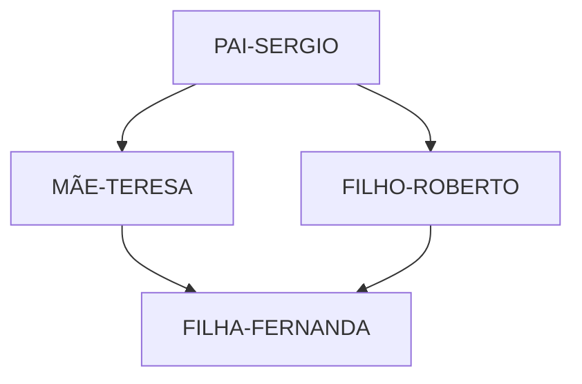
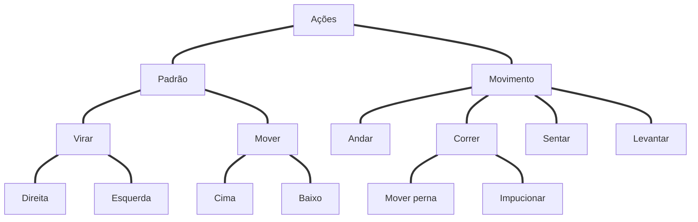

## Introdução à Programação e Pensamento Computacional

##### Pensamento contutacional
- [X] Apresentação
- [X] Introdução
- [X] Habilidade complementares
- [ ] Pilares: Decomposição
- [ ] Pilares: Padrões
- [ ] Pilares: Abstração
- [ ] Pilares: Algoritmos
- [ ] Estudo de caso conceitual: perdido
- [ ] Estudo de caso aplicado: Soma de um intervalo
- [ ] Estudo de caso aplicado: Adivinhe um número

##### Introdução à lógica de progrmação
- [ ] O que é lógica?
- [ ] Técnicas de lógica de programação

#### Fundamentos de algoritimos
- [ ] Tipologia e variáveis
- [ ] Instruções primitivas
- [ ] Estruturas condicionais e operadores
- [ ] Estruturas de repetição
- [ ] Vetores e matrizes
- [ ] O que são funções?
- [ ] Instruções de entrada/saída

#### Linguagens de programação
- [ ] Introdução à linguagens de programação
- [ ] Como um computador entende o programa?
- [ ] Características de um programa
- [ ] Análises de código
- [ ] Paradigmas de programação

#### Primeiro contato com progrmação
- [ ] Algoritmos em portugol
- [ ] Considerações finais
- [ ] Materiais de apoio
- [ ] Certifique seu conhecimento


### Apresentação
  - Juliana Mascarenhas
    - Tech Education Specialist / Sócia (Content Creator) @SimplificandoRedes
    - Me Modelagem Computacional / Cientista de dados
    - @in/juliana-mascarenhas-ds/

    - Tech Education Specialist
    - Sócia no @SimplificandoRedes
    - https://github.com/julianazanelatto
    - Cientista de dados
    - Desenvolvedora Java/Python
    - Me Modelagem Computacional - LNCC


### Objetivo Geral
Você será capaz de entender o que significa pensar computacionalmente.
Pensamento aplicável à qualquer área do conhecimento.

Dessa forma, será capaz de resolver qualquer problema de uma maneria mais objetiva e eficiente.

### Percurso
  - Aula 1 Pensamento Computacional
  - Aula 2 Introdução à lógica da programação
  - Aula 3 Fundamentos de Algoritmos
  - Aula 4 Linguagens de programação
  - Aula 5 Primeiro contato com a programação


## Aula 1: Pensamento Computacional
 //Primeiros passos para começar a programar
 
###Objetivo Geral
Apresentar os conceitos que caracterizam o pensamento com putacional, permitindo que o Dev entenda o que significa pensar computacionalmente.

### Percurso
 - Etapa 1 Introdução ao pensamento computacional
 - Etapa 2 Habilidade complementares
 - Etapa 3 Pilares: Decomposição
 - Etapa 4 Pilares: Padrões
 - Etapa 5 Pilares: Abstração
 - Etapa 6 Pilares: Algoritmos
 - Etapa 7 Estudo de caso conceitual: perdido
 - Etapa 8 Estudo de caso aplicado: Soma de um intervalo
 - Etapa 9 Estudo de caso aplicado: Adivinhe um número

## Etapa 1 Introdução ao pensamento computacional
// Primeiros passos para programar/Pensamento Computacional

#### Overview
Pensamento computacional?

Processo de pensamento envolvido na expressão de soluções em passos computacionais ou algoritmos que podem ser implementados no computador.

(Aho, 2011; Lee, 2016)


> Habilidade generalista
  - Sistemático e eficiente
    - Formulação e resolução de problemas

  - Sejam capazes de resolver
    - Humanos & máquinas

  - Baseado em 4 pilares - Dividir um problema complexo em subproblemas
    - Decomposição
    - Reconhecimento de padrões
    - Abstração
    - Design de algoritmos

 - 1 Dividir um problema complexo em subproblemas
 - 2 Identificar padrões ou tendências
    - Similaridades e diferenças entre os problemas - Padrão comportamental
 - 3 Extrapolar o conceito do problema para um forma generalista   
 > POO
 > - Classes
 > - Métodos
 > - Heranças
 > - Poliformismo

- 4 Automatizar Definir passo a passo a solução do problema.


### Overview
Processo Contínuo
• Definir uma solução
• Testar a solução
• Aperfeiçoamento da solução encontrada

.


.


.


.


### Exemplos
###### Química
- Aperfeiçoamento de reações químicas pela utilização de algoritmos, através da identificação de quimícos 
###### Engenharia
- Simulações de aeronavas executadas via software em detrimento do tunel de vento
###### Biologia
- Modelagem e mapeamento do genoma humano
###### Computação
- Simulação de problemas de alta ordem em supercomputadores


### Competências
 - Pensamento sistemático
 - Colaboração dentro da equipe
 - Criatividade e design
 - Facilitador


## Etapa 2 Habilidades complementares
// Primeiros passos para começar a programar/Pensamento Computacional

### Habilidades
 - Raciocínio Lógico
 - Aperfeiçoamento
  
**Raciocínio lógico** é uma forma de pensamento estruturado, ou raciocínio, que permite encontrar a conclusão ou determinar a resolução de um problema.

- Classificação
  - Indução - Ciências experimental
  - Dedução - Ciências exatas
  - Abdução - Processo investigativo e Diagnostico

Indução(Fenômeno observado) -> Leis e Teorias -> Dedução(Previsões e explicações) -> Abdução (Apartir de uma conclusão se tem uma Premissa)

> Ex.: A grama está molhada, logo deve ter chovido.

 .


> Um pai, mãe e seu casal de filhos estão sentados em uma mesa. Os homens se chamam Roberto e Sérgio, as mulheres Teresa e Fernanda. Sabe-se que o pai está à frente de Fernanda e o filho e esquerda; e que a mãe está do lado direito de Sérgio.



Melhoramento = Ato de aperfeiçoar = Aprimoramento = Refinamento

```
A partir de uma solução, determinar pontos de melhora e refinamento
```

#### Ato de aperfeiçoar
  - Melhor uso de recursos
    - Encontrar solução eficiente 
    - Otimizar processos

  - Melhorar códigos e algoritmos
    - Simplificar linhas de códigos
    - Funções bem definidas


### Etapa 3 Pilares: Decomposição
// Primeiros passos para começar a programar/ Pensamento Computacional/


#### Objetivo Geral
É preciso coompreender como executar cada etapa de um pensamento computacional.

Dessa forma, as aulas subsequêntes são dedicadas à compreensão individual de cada pilar desse processo de pensamento.

```
"If you can't solve a problem,
then there is an easier
problem that you can solve: find it"

*George Polya – professor e matemático*
```

Primeiro passo da resolução de problemas dentro do conceitode pensamento computacional 

"Dado um problema complexo, devemos quebra-lo em problemas menores. Portanto, problemas mais fáceis e gerenciáveis."

### Estratégia
#### Análise
Processo de quebrar e determinar partes menores e gerenciáveis
  - Estudar, explorar 
  - "realizar exame detalhado" 
  - Decompor em elementos constituíntes

#### Síntese
Combinar os elementos e recompondo o problema original
 - Processo de reconstrução
 - Fundir os elementos de maneira coerente
 - Consiste em reunir elementos distintos em um único elemento

#### Ordem de execução de tarefas menores
  - Sequêncial
  - Paralelo

### Sequêncial
Ordem de execução de tarefas menores
  - Dependência entre tarefas.
  - Executadas em "fila"

### Paralelo
Ordem de excução de tarefas menores. Tarefas podem ser execultadas concomitantemente
 - + Eficiência
 - - Tempo

- Variáveis
- Pequenos Problemas
- Segmentação

 - Não basta aplicar
 - Desenvolver a decomposição "By yourself"

> Maneiras distintas de decompor o mesmo problema.

### Como decompor?
Identificar ou coletar dados => Agregar os dados => Funcionalidade => Decomposição

##Exemplos

**Exemolo do cotidiano: cozinhar**
  - Identificar os ingredientes
  - Determinar as etapas (sequêncial ou paralelo)
  - Executar cada etapa
  - Agregar os ingredientes para finalizar (Recompor com coerência)

**Exemplo do cotidiano: funcionamento de uma bike**
Funcionamento do sistema
 - Identificar os componentes
 - Papel de cada componente
 - Interdependência das peças

**Exemplo: criar um app** - Desenvolvimento mais eficiênte
Definição de componentes e etapas
  - Finalidade
  - Interface
  - Funcinalidades
  - Pré-requisitos
 
 **Exemplo: Artigo** - Sequencial ou paralelo em ordem ou não
Definição de componentes e etapas
  - O que será abordado?
  - Estrutura
  - Conteúdo de cada tópico
  - Textos de conexão
 
 **Exemplo: movimentos de um avatar**
 

 


